# 应声 · 直播互动助手使用指南

适用版本：0.4.5 · Windows x64 / Mac Apple 芯片版

应声支持两种评论发送方式：**实时互动**适合根据直播现场内容随时发起；**评论计划**适合提前安排账号、正文和发送时间。

本指南按首次使用的先后顺序编写。截图取自当前版本页面，店铺、账号、设备码、时间及执行结果均为演示数据，不代表真实业务记录。请替换成自己的信息。

## 使用顺序

**安装应用 → 导入许可证 → 添加店铺 → 添加直播 → 配置账号 → 等待登录有效 → 发起实时互动或运行评论计划 → 查看结果与下载日志。**

小鹅云账号还需先完成：**配置小鹅云凭据 → 选择登录鉴权直播**。

> 注：使用小鹅云需要开通websdk功能包权限

## 1. 安装与首次启动

### Windows

1. 获取 `应声-0.4.5-windows-x64-setup.exe`。
2. 双击安装包，按安装向导完成安装。
3. 从桌面或开始菜单打开「应声」。

当前 Windows 安装包适用于 Intel/AMD 64 位电脑，推荐使用 Windows 10/11。

### Mac Apple 芯片

1. 获取 `应声-0.4.5-mac-arm64.dmg`。
2. 打开 DMG，将「应声」拖入「Applications / 应用程序」。
3. 从「应用程序」启动应声。

此安装包适用于 M 系列 Apple 芯片 Mac。Intel 芯片 Mac 不使用这个包。

首次启动若系统提示开发者未验证，请先确认安装包来自授权提供方。Windows 可在确认来源后按系统提示继续；Mac 可查看「系统设置 → 隐私与安全性」中的允许打开选项。若仍无法启动，将完整提示反馈给提供方。

## 2. 激活授权

首次打开会进入授权页面。

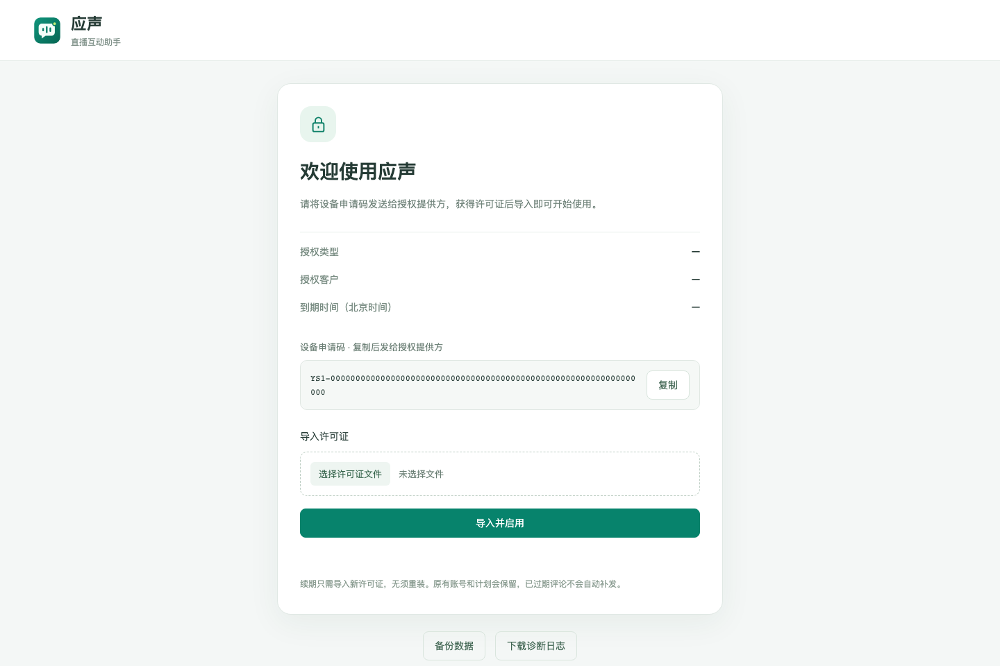

1. 点击设备申请码右侧的「复制」。
2. 将设备申请码发送给授权提供方，获取对应设备的许可证文件。
3. 点击「选择许可证文件」，选择收到的 `.yslicense` 文件。
4. 点击「导入并启用」。
5. 显示「授权有效」后，点击「进入工作空间」。

**一证一设备。** 更换电脑时，需要提供新电脑的设备申请码。

之后可点击工作空间左下角的授权状态，查看到期时间或导入新的许可证。续期无需重装应用，原有配置和数据会保留。授权到期后停止派发新评论和启动登录维护；续期后，账号维护恢复，评论任务需要手动重新发起，已过期评论不会自动补发。

## 3. 添加店铺与直播

### 3.1 添加店铺

进入左侧「店铺与直播」，点击右上角「添加店铺」。

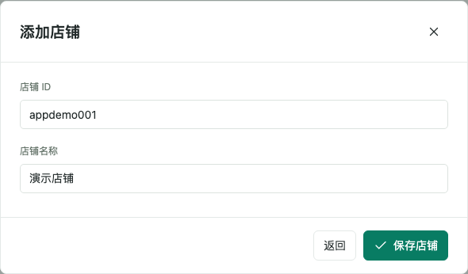

1. 输入店铺 ID，例如 `app…`。填写 ID 本身，不填写整个网页链接。
2. 稍等片刻，系统自动获取店铺名称。
3. 核对名称；可以修改，也可以在获取失败时手动填写。
4. 点击「保存店铺」。

有多个店铺时，使用页面顶部的「店铺」下拉框切换。**账号属于店铺，可供该店铺下的不同直播使用；评论计划属于具体直播。** 操作前先确认当前店铺。

### 3.2 添加直播

在已选中的店铺内，点击「直播列表」右侧的「添加直播」。

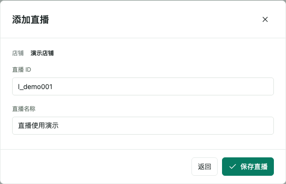

1. 输入属于当前店铺的直播 ID，例如 `l_…`。
2. 等待直播名称自动补全，并核对或手动修改。
3. 点击「保存直播」。

直播 ID 通常可在观看链接的路径中找到，例如 `/detail/l_…/4` 或 `/course/alive/l_…` 中的 `l_…` 部分；后面的 `?app_id=…` 等参数不要一起复制。

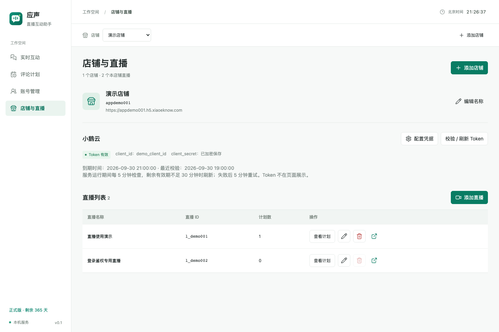

在「实时互动」和「评论计划」页面，顶部还会出现「直播」下拉框。**发送前必须核对店铺和直播两个选择。**

### 3.3 使用小鹅云账号时，先配置小鹅云

> 注：使用小鹅云需要开通websdk功能包权限

如果只使用手机号和密码维护账号，可跳过本节，直接看第 4.1 节。

在「店铺与直播 → 小鹅云」点击「配置凭据」。

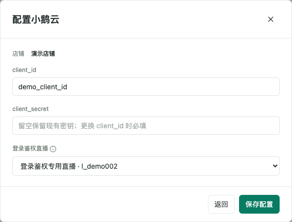

1. 填写当前店铺对应的 `client_id` 和 `client_secret`。
2. 选择「登录鉴权直播」：必须是已添加、未删除且可正常访问的本店铺直播。
3. 点击「保存配置」。保存后会立即获取并校验 access_token。
4. 确认小鹅云区域显示「Token 有效」。必要时使用「校验 / 刷新 Token」重试。

登录鉴权直播用于获取和维护用户登录态。**实际发送到哪个直播，仍由发送页面顶部的直播选择决定。**

应用运行期间会自动维护 Token。小鹅云凭据保存后不回显密钥；编辑时留空可保留原密钥，更换 `client_id` 时需重新填写密钥。

正在使用的登录鉴权直播不能直接删除。需先在这里更换为另一场正常直播并保存。

## 4. 添加账号，等待登录有效

进入「账号管理」。账号分为「账号密码」和「小鹅云」两个 Tab，按手头的信息选择一种方式。

**每个店铺合计最多 50 个账号，两种方式共用这个额度。** 满额后添加和导入按钮不可用。账号列表每页 10 条。

### 4.1 方式一：手机号和密码

在「账号密码」Tab 点击「添加账号」。

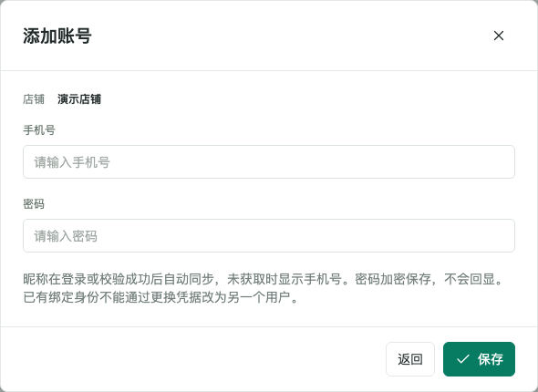

1. 输入手机号和密码。
2. 点击「保存」，系统随即开始登录。
3. 等待后台完成登录、确认身份和保存登录态。

账号默认开启自动维护，保存后立即登录。昵称会在登录或校验成功后同步，无需手动填写别名。

**批量导入：**点击「导入账号」→ 下载 Excel 模板 → 第一列填手机号、第二列填密码 → 选择 `.xlsx` 文件 → 点击「导入并登录」。首行可以保留模板表头；每行填一个账号。一次最多 50 个，且不能超过当前店铺剩余额度。任意一行格式不符合要求时，整批拒绝，修改后重新导入。

密码变更后，点击该账号行的「设置」，更新密码并保存。已有值留空时按页面提示保留原值。

### 4.2 方式二：小鹅云 user_id

先完成第 3.3 节的小鹅云配置，再切换到「小鹅云」Tab，点击「添加小鹅云账号」。

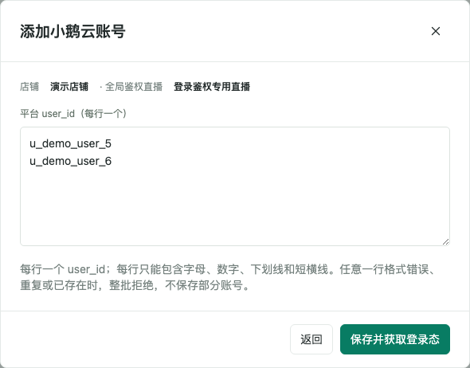

1. 输入当前店铺中的平台用户 `user_id`，每行一个。
2. 可一次粘贴多个 ID，最多 50 个，且不能超过剩余额度。
3. 点击「保存并获取登录态」。

示例（请替换为真实 ID）：

```text
u_demo_user_5
u_demo_user_6
```

每个 ID 只允许字母、数字、下划线和短横线，不强制要求 `u_` 前缀。不要插入空行，也不要用逗号、空格将多个 ID 放在同一行。格式错误、重复或已存在时，整批拒绝，需要改正后重新保存。

所有新增账号默认自动维护，保存后立即获取登录态。获取成功后同步昵称。账号行的「获取登录态」可用于手动重新触发；「设置」会回显当前 user_id，不能将已有账号改成另一个用户。

### 4.3 看懂登录状态与维护状态

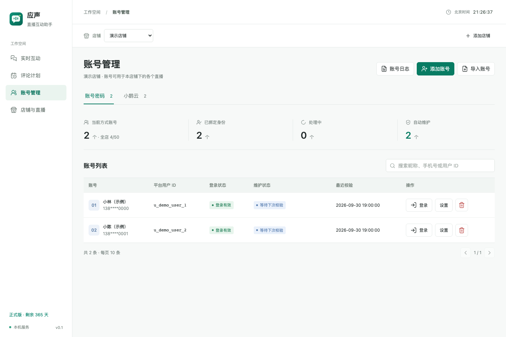

| 看哪一列 | 显示内容 | 如何理解 |
|---|---|---|
| 登录状态 | 登录有效 | 当前保存的登录态可供发送使用 |
| 登录状态 | 登录态不可用 | 当前不能用于发送，等待维护成功或处理问题 |
| 维护状态 | 排队中 | 正在等待维护名额，不表示已经登录成功 |
| 维护状态 | 登录中、确认身份中、保存中 | 正在取得并保存新的登录态，等到左侧变为「登录有效」再使用 |
| 维护状态 | 校验中 | 正在检查已有登录态；是否可用仍看「登录状态」列 |
| 维护状态 | 等待下次校验 | 本轮维护完成，等待下次自动检查 |
| 维护状态 | 等待重试 | 暂时失败，将按页面显示的时间自动重试 |
| 维护状态 | 需要人工处理 | 查看具体原因，检查密码、用户状态或小鹅云配置后再重试 |

账号管理独立维护登录态，发送功能使用已经维护好的登录态。发送时如果登录态不可用，会跳过该用户，不会为这次发送现场重新登录。

批量添加后，账号会并发维护，部分账号显示排队是正常情况。应用运行期间会周期性检查，不必反复点击登录。

右侧搜索框支持按昵称或用户 ID 查找；账号密码 Tab 还支持手机号。顶部统计针对整个当前登录方式，不随搜索结果或分页变化，因此可能多于当前页可见行数。

## 5. 实时互动：根据直播现场发起

准备好账号后，进入「实时互动」。先创建用户组；如果要随机内容，再创建内容组。

### 5.1 创建用户组

切换「用户组」，点击「添加用户组」。

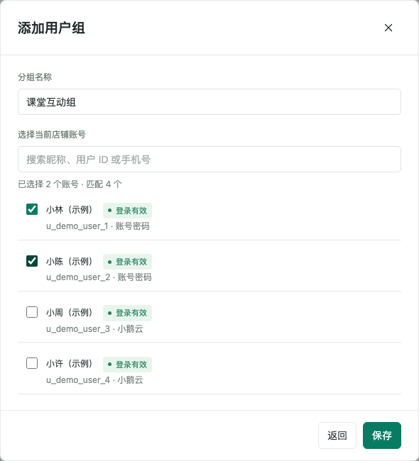

1. 填写便于识别的分组名称。
2. 使用搜索框查找账号，勾选本轮常用的成员。
3. 点击「保存」。

每组支持 1～50 个不同账号，只能新加入「登录有效」的账号。组内账号以后失效时，不会因此自动从组中删除；发送时会跳过，可在编辑分组时移除。

### 5.2 随机内容模式：先创建内容组

切换「内容组」，点击「添加内容组」。

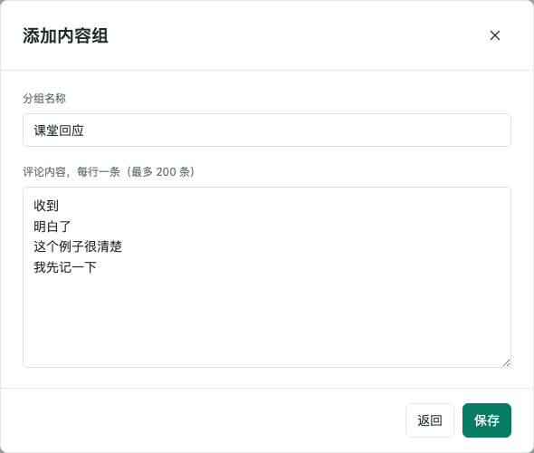

填写分组名称，将内容按**每行一条**填入，点击「保存」。每组最多 200 条，每条最多 512 个字符，不要留空行。统一内容模式无需内容组。

### 5.3 统一内容：每人发送同一句

切换「发起互动」，核对顶部店铺和直播。

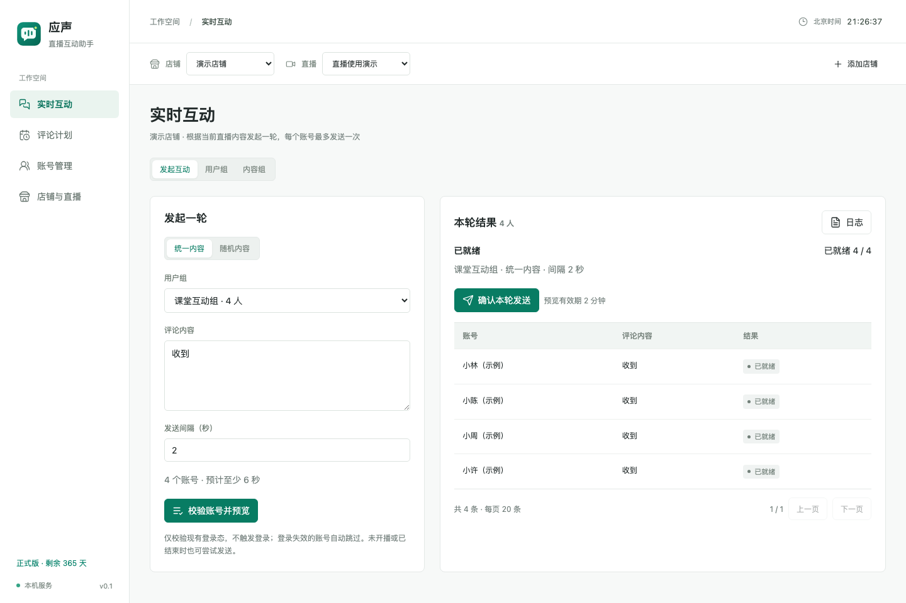

1. 选择「统一内容」。
2. 选择用户组。
3. 输入本轮评论，例如「收到」。
4. 设置发送间隔，支持 1～30 秒的整数。
5. 点击「校验账号并预览」。此时尚未发送评论。
6. 在右侧查看分配的账号、正文和状态。
7. 点击「确认本轮发送」，在确认弹窗中核对信息、勾选确认项，再点击「确认发送」。

一轮内，每个可用账号最多发送一次。组内有 10 个可用账号，就会安排 10 条相同内容。

### 5.4 随机内容：每人随机分配一条

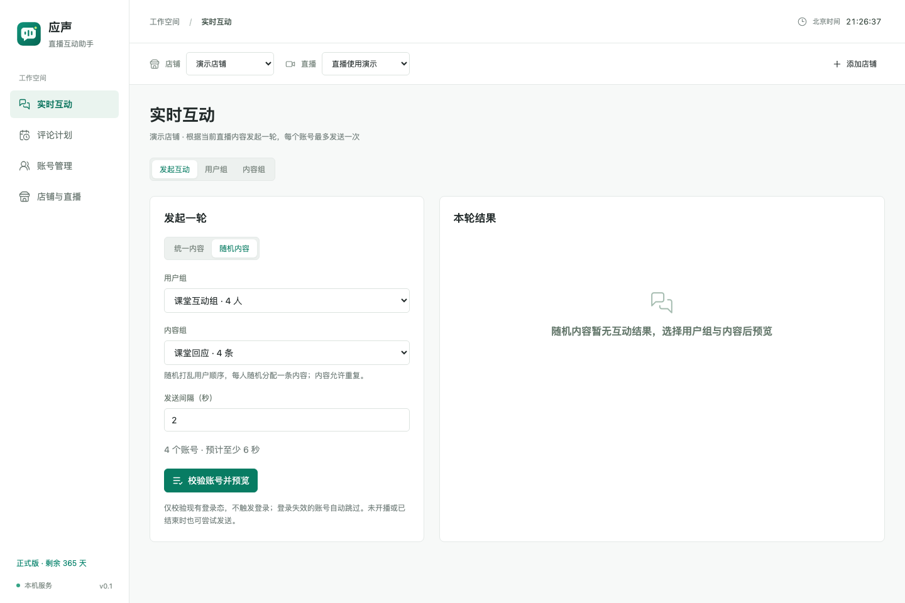

选择「随机内容」后，选择用户组、内容组和发送间隔，再按相同的「校验账号并预览 → 确认本轮发送 → 确认发送」流程操作。

系统随机打乱用户顺序，每人随机分配一条内容；**内容允许重复**，不保证每条内容都会被抽中。切换统一内容和随机内容时，右侧结果会联动切换。

### 5.5 查看结果与停止

- 预览有效期为 2 分钟，超时后需重新预览。
- 登录失效账号会跳过；其他异常请查看具体原因。页面要求明确排除异常账号时，核对后勾选对应确认项。
- 发送期间可点击「停止本轮」。已经提交的评论无法撤回，剩余任务将停止。
- 右侧结果每页 20 条。点击「日志」查看执行过程并下载。
- 每场直播、每种内容模式保留最后一轮日志；需要保留的日志，应在下一轮前下载。
- 未开播或已结束时也会尝试真实发送，直播状态仅作为提示，能否成功仍以平台实际响应为准。

## 6. 评论计划：按北京时间定时发送

进入「评论计划」，先选择顶部店铺和目标直播。

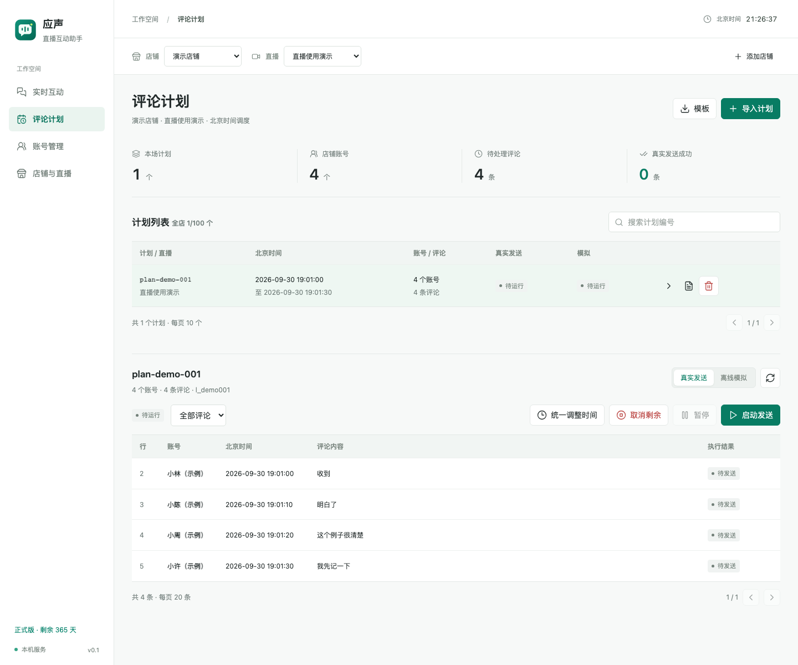

### 6.1 下载模板并填写

点击右上角「模板」，使用 Excel 打开下载的 `.xlsx` 文件。

保留三列表头，不添加其他数据列：

| 用户ID | 北京时间 | 评论内容 |
|---|---|---|
| u_demo_user_1 | 2026-10-01 19:00:05 | 收到 |
| u_demo_user_2 | 2026-10-01 19:00:08 | 明白了 |

上表仅演示格式。**导入前请替换用户 ID，并将时间改为实际需要的未来时间。**

填写规则：

- 用户 ID 应对应当前店铺已添加并绑定身份的账号，可从「账号管理」复制。每一行代表一条评论，同一个用户可以出现多行。
- 北京时间必须包含完整日期与秒，格式为 `YYYY-MM-DD HH:mm:ss`。**先把时间列设置为“文本”，再输入或粘贴时间**，避免 Excel 自动转为日期型单元格。
- 时间表示北京时间，不是直播开始后的相对时长。跨零点时，后续行日期要切换到第二天。
- 正文不能为空，每条最多 512 个字符。
- 仅保留一个工作表；删除模板示例、不使用的行和中间空行，不要只清空正文而留下其他列。
- 每份文件最多 5 MB、10,000 条评论、50 个不同用户。每个店铺最多保存 100 个计划。
- 保存为标准 `.xlsx`，不要用 `.xls`、CSV 或直接修改扩展名代替。

### 6.2 导入计划

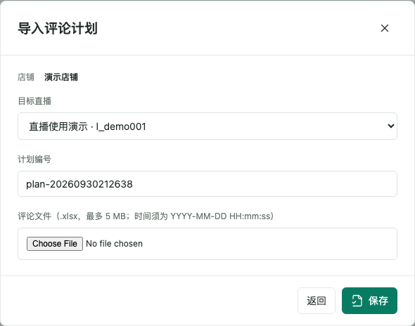

1. 点击「导入计划」。
2. 确认目标直播。
3. 保留自动生成的计划编号，或填写便于识别的编号；仅支持字母、数字、下划线和短横线，最长 48 个字符。
4. 选择填写好的 Excel 文件，点击「保存」。
5. 系统校验所有行。任意一行不符合要求时，整份拒绝，按报错行修改后重新上传。
6. 校验通过后，在预览中核对直播、账号、时间和正文，点击「确认导入」。

**导入完成不会自动真实发送。** 还需手动启动计划。

计划列表每页 10 个，评论明细每页 20 条，明细按发送时间升序排列。点击一行或最右侧的查看箭头，可查看下方明细。该行三个操作从左到右是：**查看、日志、删除**。

### 6.3 先进行离线模拟（可选）

1. 打开计划明细，切换到「离线模拟」。
2. 点击「运行模拟」。
3. 选择模拟速度，点击「开始模拟」。

10× 表示按 10 倍速度预演，例如原本相隔 30 秒的两条评论，模拟时相隔约 3 秒。正式发送仍按计划中的北京时间执行。

**模拟仅在本地预演执行顺序和调度，不会向直播间发送评论。模拟通过不代表真实登录、直播权限和发送接口校验通过。**

### 6.4 必要时统一调整时间

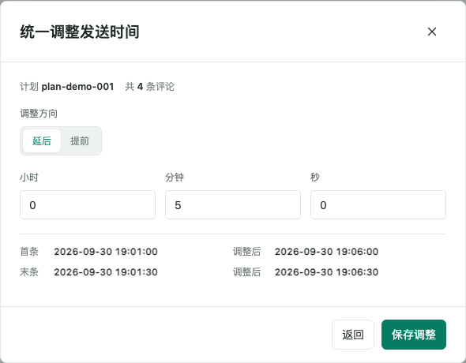

如果直播推迟或模板时间已经过去，可在计划明细点击「统一调整时间」：

1. 选择「延后」或「提前」。
2. 填写小时、分钟、秒。
3. 核对首条和末条的调整后时间。
4. 点击「保存调整」。

所有评论在原时间基础上加减相同的时长，原有间隔保持不变。只有**尚未真实执行、未取消真实发送且当前未运行**的计划可调整。模拟过的计划也可调整，但会重置原有模拟结果和模拟取消状态，需要时重新模拟。

### 6.5 启动真实发送

1. 切换回「真实发送」。
2. 确认账号处于「登录有效」，发送时间尚未到达。
3. 点击「启动发送」。
4. 在确认弹窗中核对店铺、直播、账号、北京时间和正文。
5. 勾选确认项，点击「确认启动发送」。

保持应声运行、网络连接正常、电脑不休眠。到达计划时间后，系统按顺序安排发送。未开播或已结束时仍会尝试，直播状态提示不代表已经发送失败。

**暂停、继续与取消：**

- 「暂停」停止继续派发，保留未完成任务；之后可点击「继续发送」。
- 「取消剩余」终止当前所选模式下的剩余任务，操作前确认是真实发送还是离线模拟。已发送的评论不会撤回。
- 启动或恢复时已经过期的评论不会补发。运行中遇到排队、网络等延迟，最多容许延迟 60 秒，超时后跳过。
- 电脑睡眠会使任务暂停运行；唤醒后不要期待补齐睡眠期间的评论，应先查看结果。
- 发送时登录态不可用的账号会被跳过。处理账号问题后，先核对已发送记录，再另行安排需要重发的内容。

### 6.6 查看和下载执行日志

在计划列表点击中间的「日志」图标。

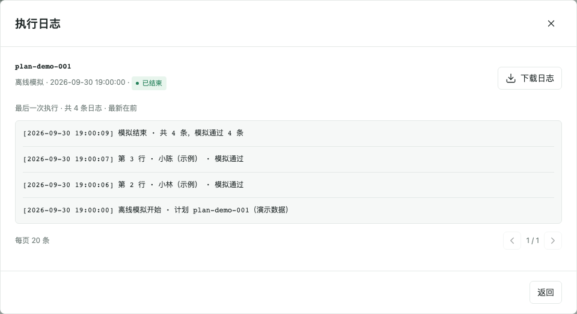

日志显示执行过程及错误原因，最新记录在前，每页 20 条。点击「下载日志」保存到本机。

**每个计划只保留最后一次执行日志，模拟和真实发送共用这个入口。** 需要保留的日志请及时下载，尤其是在再次运行或模拟之前。

## 7. 日常管理、升级与退出

### 删除数据

| 操作 | 影响 |
|---|---|
| 删除账号 | 需要确认；有评论计划引用时禁止删除，先处理相关计划 |
| 删除用户组 | 删除分组，账号和登录态保留 |
| 删除评论计划 | 删除本工具内对应的评论明细、执行记录、日志及发送去重记录；平台已收到的评论不会撤回 |
| 删除直播 | 需要二次确认；关联评论计划和执行记录同步删除，店铺账号保留 |
| 删除登录鉴权直播 | 当前使用中的鉴权直播禁止删除；先在小鹅云配置中更换 |

删除前下载需要留存的日志。运行中的相关任务应先停止或暂停，再按页面提示操作。

### 升级

完全退出旧版本后安装新版：Windows 运行新版安装包；Mac 将新版应用替换到「应用程序」。正常覆盖安装保留原有店铺、账号、计划和许可证，无需先清除数据。

### 退出与长时间运行

关闭窗口时按弹窗选择继续运行或退出。退出会停止账号维护和评论任务，收尾可能需要一些时间；等待退出完成后再重开或升级。

需要持续运行时，可最小化应用并保持电脑接通电源、联网。**关闭显示器与系统休眠不同**：屏幕可以熄灭，但电脑不能进入系统睡眠。Mac 合盖通常会休眠；Windows 也需检查插电时的睡眠设置。

## 8. 出现问题时如何反馈

### 8.1 账号登录或维护问题

进入「账号管理」，点击右上角「账号日志」。

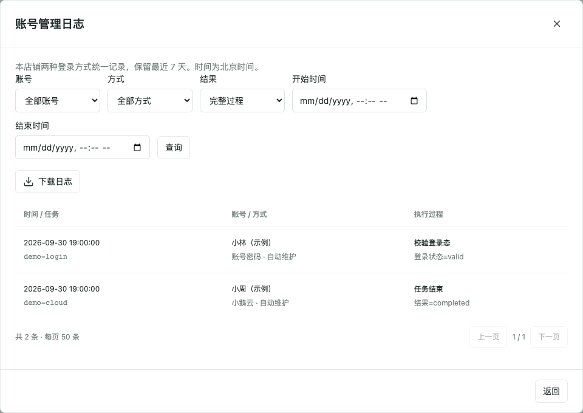

可按账号、登录方式、结果及时间范围筛选，再点击「查询」和「下载日志」。日志覆盖两种账号方式，默认保留最近 7 天，过期记录自动清理。

先看「维护状态」下面的具体原因：密码错误应更新密码；小鹅云获取失败应检查凭据、店铺授权、接口权限及用户是否仍有效；网络暂时异常可等待自动重试。反复失败时下载日志反馈，不必连续重复点击登录。

### 8.2 评论未发出

先查看对应计划或互动轮次的结果与日志：

| 提示或现象 | 建议处理 |
|---|---|
| 登录态非有效、登录态不可用 | 到账号管理检查状态，等待维护成功后再安排新的发送 |
| 超时、已跳过 | 核对北京时间、电脑是否睡眠以及网络；已过期评论不自动补发 |
| 发送前失败、保存被拒绝 | 查看具体阶段及返回码，下载日志反馈 |
| 结果待确认、广播结果待确认 | 先在直播间核实并保留日志，避免立即重复发送造成重复评论 |
| 直播未开播或已结束的提示 | 这是直播状态提醒，继续查看该条最终执行结果 |
| 操作一直显示加载 | 等待处理完成；若提示超时，先刷新查看是否已成功，避免重复导入或重复提交 |

### 8.3 授权或启动问题

- 授权到期：联系授权提供方，获取绑定本机的新许可证并导入。
- 设备不匹配：复制当前电脑的设备申请码，核对签发对象。
- 系统时间异常：检查系统日期、时间及时区，恢复正确时间后重启应用。
- 程序文件校验失败：保留完整提示，确认使用 0.4.5 或更新版本，联系提供方排查。该提示不等于许可证过期，反复导入新许可通常不能解决程序文件问题。

能进入授权页面时，可点击「下载诊断日志」。不能启动时，可提供下方的 `integrity.log`（若已生成）及错误截图。

| 系统 | 日志所在目录 |
|---|---|
| Windows | `%APPDATA%\YingshengDesktop\workspace\.private` |
| Mac | `~/Library/Application Support/YingshengDesktop/workspace/.private` |

启动与运行日志为 `desktop-server.log`；程序校验诊断为 `integrity.log`。Windows 可将目录粘贴到资源管理器地址栏，Mac 可在 Finder 使用「前往 → 前往文件夹」。应用的「帮助 → 打开数据目录」也可定位数据目录。

反馈时建议提供：**应用版本、Windows/Mac、发生时间（北京时间）、操作步骤、完整报错、对应下载日志**。账号维护问题用账号日志，计划问题用计划日志，实时互动问题用该轮日志。

授权页面的「备份数据」用于自己保存业务备份，包含账号凭据和登录态。**不要把整个数据目录或完整备份当作故障日志发送给他人。**

---

本指南可直接在仓库首页阅读。需要离线阅读时，请下载整个仓库，保持 `README.md` 与 `images` 文件夹的相对位置不变，以保证图片正常显示。
